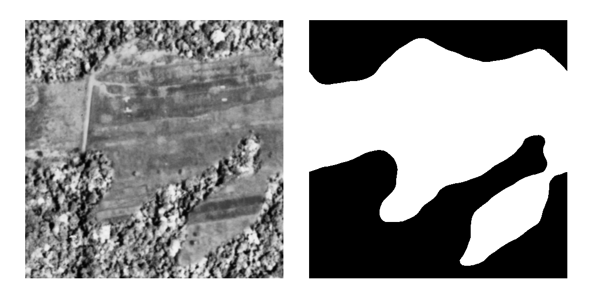
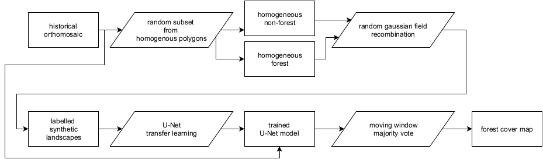

# Ortho DRC Deep Learning forest classifier

This is the code used to train the model (src/forest_model.h5) to classify forest and non forest pixels and a 1958 historical orthomosaic covering a large section of Yangambi in the Central Congo Basin, DR Congo (then Belgian Congo).

When using the model cite the model / code / data as:

`Hufkens et al. 2020. Historical aerial surveys map long-term changes of
forest cover and structure in the central Congo Basin. Submitted.`

## Methods

 We used the Unet Convolutional Neural Net (CNN) architecture implemented in Keras with an [efficientnetb3 backbone](https://github.com/qubvel/segmentation_models) running on TensorFlow to train a binary classifier (i.e. forest or non-forested). This methodology is increasingly being used to automate pixel-level classification in (color) digital photography data. Training data were collected from the orthomosaic by randomly selecting 513 pixel square tiles from homogeneous forested or non-forested areas within the historical orthomosaic.
 
 Homogeneous tiles were combined in synthetic landscapes using a random gaussian field based binary mask (Figure 3). We generated 5000 synthetic landscapes for training, while 500 landscapes were generated for both the validation and the testing dataset. Source tiles did not repeat across datasets to limit overfitting. In order to limit stitch line misclassifications, along the seams of mosaicked images, we created synthetic landscapes with different forest tiles to mimick forest texture transitions. We applied this technique to 10% of the generated synthetic landscapes. In order to limit the size of the repository the generated landscapes are not included. However, and example of a synthetic landscape and a forest / non-forest mask is provided below. A new dataset can be generated using the included code.
 
 
 
 The CNN model was trained for 100 epochs on a graphics processing unit (GPU) maximizing the Intersect-over-Union (IoU) using additional data augmentation. Data augmentation included random cropping to 320 pixel squares, random orientation, scaling, perspective, contrast and brightness shifts and image blurring. During final model evaluation we report the IoU of our out-of-sample test datasets.  The optimized model was used to classify the complete orthomosaic using a moving window approach with a step size of 110 pixels and a majority vote across overlapping areas to limit segmentation edge effects. We refer to Figure 4 for a synoptic overview of the full deep learning learning workflow. 

 

## Licenses & citation

I'm indebted to the [segmentation models](https://github.com/qubvel/segmentation_models) python package and examples from which I extensively borrowed code. To be inline with licensing all code is distributed under an MIT license. All other (image) data, and the resulting model (forest_model.h5) is distributed under a CC-BY-NC-SA license.

## Acknowledgements

This research was supported through the Belgian Science Policy office COBECORE project (BELSPO; grant BR/175/A3/COBECORE) and from the European Union Marie Skłodowska-Curie Action (project number 797668).